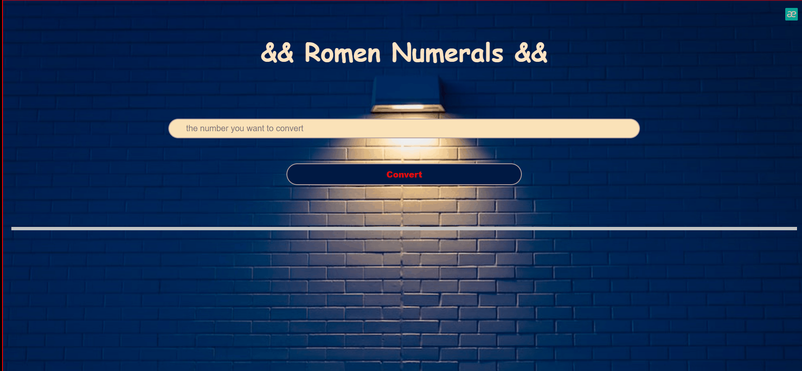

# hw-js-checkout
[Click](https://ilkaybasboga.github.io/hw-js-checkout/)


# Project : Checkout Website 

## Description
I aimed to create a project Todo-List Website .


## Project Skeleton 

```
Checkout Website . (folder)
|
|----README.md               
|---- img (images)            
|----index.html  
|----style.css
|----app.js
|----romen.gif
  

```
## Expected Outcome



## Steps to Solution
  
- Step 1: Creating the HTML structure,

- Step 2:CSS part created

- Step 3: JS file created,

- Step 4: Created Website
 
- Step 5: Submit your app to your own public repository on Github
